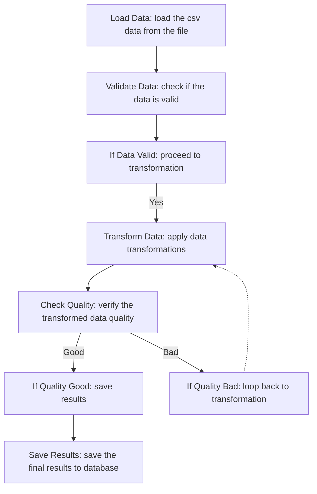

# Non-Linear Workflow System

This document describes the enhanced workflow system that supports non-linear execution paths, cycles, and conditional routing.

## Overview

The workflow system has been enhanced to support:
- **Cycles and Loops**: Workflows can now loop back to previous steps
- **Conditional Routing**: Different execution paths based on conditions
- **Dynamic Execution**: Runtime decision making based on plan connections
- **Non-Linear Flow**: Execution is not limited to a simple linear sequence

## Architecture Changes

### 1. Database Schema Updates

#### New PlanConnection Table
```sql
CREATE TABLE plan_connections (
    id UUID PRIMARY KEY,
    project_id UUID REFERENCES projects(id),
    source_step_id UUID REFERENCES plans(id),
    target_step_id UUID REFERENCES plans(id),
    connection_type VARCHAR(100) DEFAULT 'next',
    condition TEXT,
    label VARCHAR(255),
    created_at TIMESTAMP DEFAULT NOW()
);
```

#### Enhanced Plan Table
```sql
ALTER TABLE plans ADD COLUMN step_type VARCHAR(100) DEFAULT 'task';
ALTER TABLE plans ADD COLUMN condition TEXT;
```

### 2. Connection Types

The system recognizes several types of connections:

- **`next`**: Sequential execution to the next step
- **`conditional`**: Branch based on a condition (e.g., "if data valid")
- **`loop_back`**: Return to a previous step (e.g., "loop back to transformation")

### 3. New Workflow Nodes

#### ExecutePlanStep Node
- Dynamically routes workflow execution based on plan connections
- Handles loops and conditional branching
- Prevents infinite loops with execution limits
- Tracks execution path for debugging

## Usage Examples

### 1. Creating a Plan with Loops

```python
# Example plan text that will generate connections
plan_text = """
1. Load Data: load the csv data from the file
2. Validate Data: check if the data is valid
3. If Data Valid: proceed to transformation
4. Transform Data: apply data transformations
5. Check Quality: verify the transformed data quality
6. If Quality Good: save results
7. If Quality Bad: loop back to transformation
8. Save Results: save the final results to database
"""
```

### 2. Dynamic Workflow Execution

```python
from fernlabs_api.workflow.workflow_agent import WorkflowAgent

# Execute workflow dynamically based on connections
result = await agent.execute_workflow_dynamically(
    user_id=user_id,
    project_id=project_id,
    chat_history=chat_history,
    db=db_session,
    start_from_step=1
)

# Result includes execution path and routing decisions
print(f"Execution path: {result['execution_path']}")
print(f"Execution type: {result['execution_type']}")
```

### 3. Connection Parsing

```python
from fernlabs_api.workflow.base import _parse_connections_from_plan

connections = _parse_connections_from_plan(plan_text)

for conn in connections:
    print(f"Step {conn['source']} -> Step {conn['target']} ({conn['type']})")
    if conn['type'] == 'conditional':
        print(f"  Condition: {conn['condition']}")
    elif conn['type'] == 'loop_back':
        print(f"  Loop back to step {conn['target']}")
```

## Mermaid Chart Generation

The system now generates Mermaid charts that show the actual connections:



## Workflow Execution Flow

### Traditional Linear Flow
```
CreatePlan → AssessPlan → WaitForUserInput → EditPlan → AssessPlan → End
```

### New Non-Linear Flow
```
CreatePlan → [AssessPlan | ExecutePlanStep]
                    ↓
            [WaitForUserInput | Continue Execution]
                    ↓
            [EditPlan | ExecutePlanStep]
                    ↓
            [AssessPlan | Continue Execution]
                    ↓
            [End | Continue Execution]
```

## Benefits

1. **Flexibility**: Workflows can now handle complex business logic with loops and conditionals
2. **Efficiency**: Simple plans can execute directly without review
3. **Transparency**: Clear visualization of workflow connections and decision points
4. **Maintainability**: Easier to understand and modify complex workflows
5. **Scalability**: Support for workflows with hundreds of steps and complex routing

## Migration Guide

### 1. Database Migration
```bash
cd fernlabs-api
alembic upgrade head
```

### 2. Code Updates
- Import the new `ExecutePlanStep` node
- Use `execute_workflow_dynamically()` for non-linear execution
- Update plan generation to include connection indicators

### 3. Testing
```bash
python test_nonlinear_workflow.py
```

## Future Enhancements

1. **LLM Decision Making**: Use AI to make routing decisions at conditional points
2. **Parallel Execution**: Support for concurrent step execution
3. **Error Recovery**: Automatic retry and fallback mechanisms
4. **Performance Monitoring**: Track execution time and resource usage
5. **Workflow Templates**: Pre-built templates for common workflow patterns

## Troubleshooting

### Common Issues

1. **Infinite Loops**: The system prevents loops exceeding 100 iterations
2. **Missing Connections**: Ensure plan text includes clear indicators for loops and conditionals
3. **Database Errors**: Verify the migration has been applied correctly

### Debug Information

The system provides detailed execution information:
- Execution path tracking
- Connection analysis
- Mermaid chart generation
- Agent call logging

## Conclusion

The non-linear workflow system provides a powerful foundation for complex automation scenarios while maintaining backward compatibility with existing linear workflows. The connection-based approach allows for sophisticated business logic while keeping the system maintainable and understandable.
